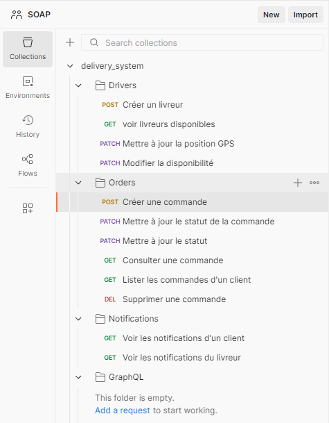
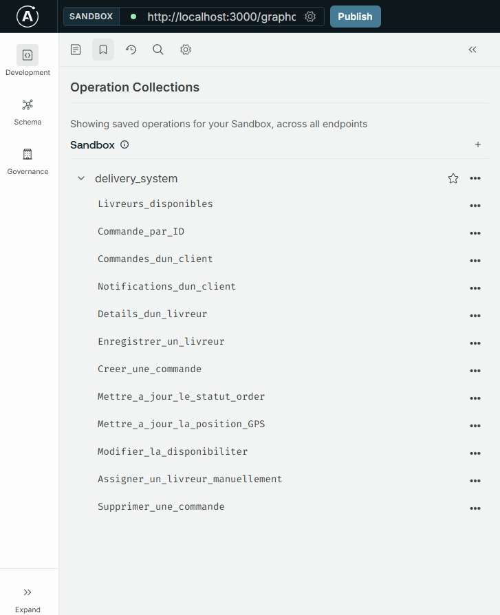
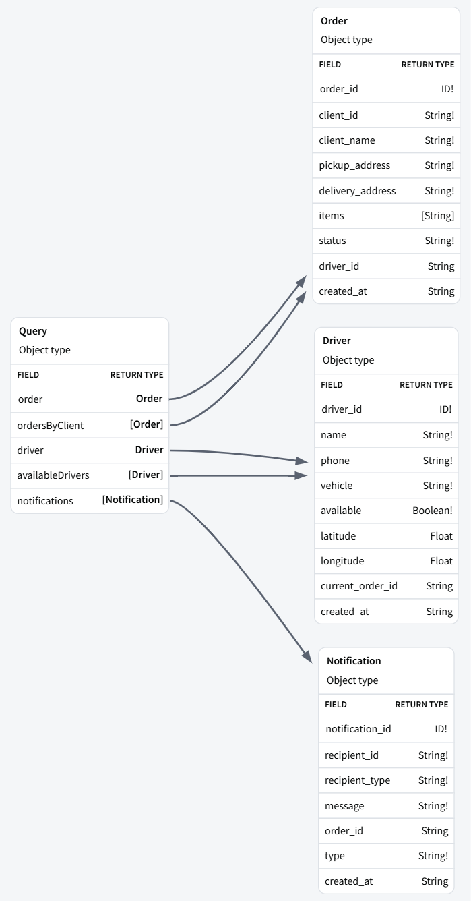
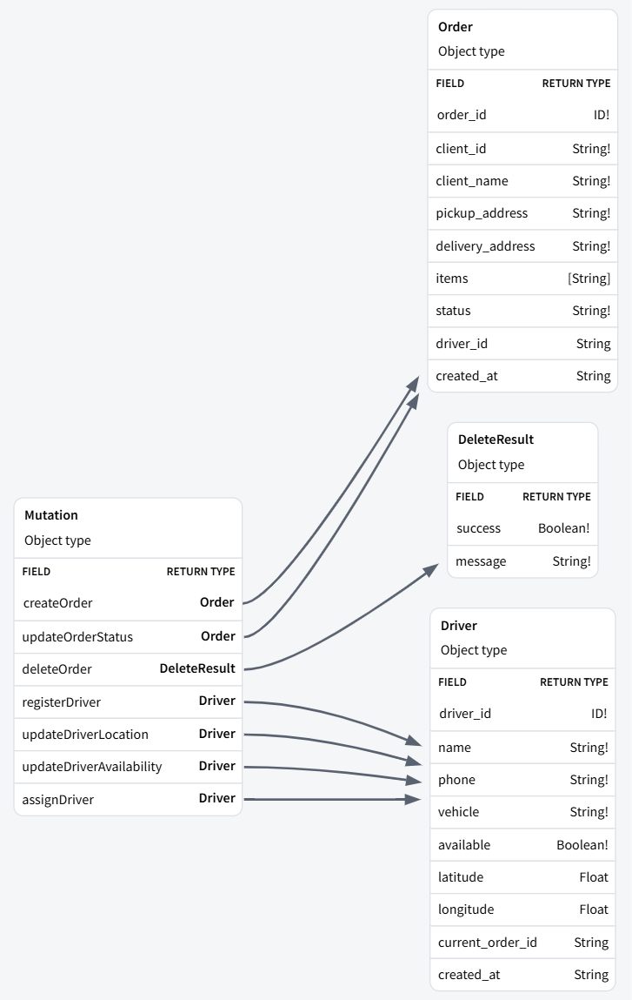

# 🚚 Delivery System — Microservices Platform

> Système de livraison en temps réel basé sur une architecture microservices Node.js  
> **SoA et Microservices — Dr. Salah Gontara — A.U. 2025-26**

---

## 📑 Table des matières

1. [Description du projet](#-description-du-projet)
2. [Schéma d'architecture](#-schéma-darchitecture)
3. [Microservices](#-microservices)
4. [Fichiers .proto (gRPC)](#-fichiers-proto-grpc)
5. [Endpoints REST](#-endpoints-rest)
6. [Schéma GraphQL](#-schéma-graphql)
7. [Topics Kafka](#-topics-kafka)
8. [Bases de données](#-bases-de-données)
9. [Instructions d'installation et d'exécution](#-instructions-dinstallation-et-dexécution)
10. [Tests & Démonstration](#-tests--démonstration)

---

## 📋 Description du projet

Ce projet implémente un **système de livraison en temps réel** basé sur une architecture microservices complète.

Il est composé de :
- **3 microservices indépendants** (Order, Driver, Notification)
- **1 API Gateway** exposant REST et GraphQL
- **Kafka** comme broker de messages asynchrones
- **gRPC + Protobuf** pour la communication inter-services
- **2 types de bases de données** (SQLite3 SQL + RxDB NoSQL)
- **Docker Compose** pour l'orchestration

### Flux métier principal

```
1. Client crée une commande via REST ou GraphQL
2. Order Service enregistre la commande → publie order.created sur Kafka
3. Driver Service consomme order.created → assigne un livreur disponible
4. Driver Service publie delivery.assigned sur Kafka
5. Notification Service consomme delivery.assigned → notifie client + livreur
6. Le livreur met à jour sa position GPS → driver.location.updated sur Kafka
7. Notification Service consomme les changements de statut → notifie le client
```

---

## 📐 Schéma d'architecture

```
┌─────────────────────────────────────────────────────────────────────┐
│                            CLIENT                                    │
│                    (REST / GraphQL / HTTP)                           │
└───────────────────────────────┬─────────────────────────────────────┘
                                │
                    REST + GraphQL (HTTP/1.1)
                                │
┌───────────────────────────────▼─────────────────────────────────────┐
│                         API GATEWAY                                  │
│                        (Express + Apollo)                            │
│                          PORT: 3000                                  │
│                                                                      │
│       /api/...  (REST)              /graphql  (GraphQL)             │
└──────────┬──────────────────────┬───────────────────┬───────────────┘
           │                      │                   │
     gRPC (HTTP/2)          gRPC (HTTP/2)       gRPC (HTTP/2)
     Protobuf               Protobuf             Protobuf
           │                      │                   │
┌──────────▼──────┐   ┌───────────▼──────┐  ┌────────▼──────────────┐
│  ORDER SERVICE  │   │  DRIVER SERVICE  │  │ NOTIFICATION SERVICE  │
│   PORT: 50051   │   │   PORT: 50052    │  │     PORT: 50053       │
│                 │   │                  │  │                       │
│   SQLite3       │   │  RxDB + LevelDB  │  │      SQLite3          │
│  (orders.db)    │   │ (drivers_rxdb/)  │  │ (notifications.db)    │
└────────┬────────┘   └────────┬─────────┘  └──────────┬────────────┘
         │                     │                        │
         │      ┌──────────────▼────────────────────────▼──────────┐
         └─────►│                 KAFKA BROKER                      │
                │              (Confluent 7.5.0)                    │
                │                                                   │
                │  • order.created           (producer: Order)      │
                │  • delivery.assigned       (producer: Driver)     │
                │  • order.status.updated    (producer: Order)      │
                │  • driver.location.updated (producer: Driver)     │
                └───────────────────────────────────────────────────┘
```

---

## 🧱 Microservices

| Service | Port | Base de données | Rôle |
|---|---|---|---|
| **Order Service** | `50051` | SQLite3 | Gestion du cycle de vie des commandes |
| **Driver Service** | `50052` | RxDB + LevelDB | Gestion des livreurs et assignations |
| **Notification Service** | `50053` | SQLite3 | Envoi et stockage des notifications |
| **API Gateway** | `3000` | — | Point d'entrée REST + GraphQL |

---

## 📄 Fichiers .proto (gRPC)

### `proto/order.proto`

```protobuf
service OrderService {
  rpc CreateOrder       (CreateOrderRequest)  returns (OrderResponse);
  rpc GetOrder          (GetOrderRequest)     returns (OrderResponse);
  rpc UpdateOrderStatus (UpdateStatusRequest) returns (OrderResponse);
  rpc ListOrders        (ListOrdersRequest)   returns (ListOrdersResponse);
  rpc DeleteOrder       (GetOrderRequest)     returns (DeleteResponse);
}
```

### `proto/driver.proto`

```protobuf
service DriverService {
  rpc RegisterDriver      (RegisterDriverRequest)     returns (DriverResponse);
  rpc GetDriver           (GetDriverRequest)          returns (DriverResponse);
  rpc UpdateLocation      (UpdateLocationRequest)     returns (DriverResponse);
  rpc UpdateAvailability  (UpdateAvailabilityRequest) returns (DriverResponse);
  rpc GetAvailableDrivers (Empty)                     returns (ListDriversResponse);
  rpc AssignDriver        (AssignDriverRequest)       returns (DriverResponse);
}
```

### `proto/notification.proto`

```protobuf
service NotificationService {
  rpc SendNotification (SendNotificationRequest) returns (NotificationResponse);
  rpc GetNotifications (GetNotificationsRequest) returns (ListNotificationsResponse);
}
```

---

## 🌐 Endpoints REST

Base URL : `http://localhost:3000/api`

### 📦 Orders

| Méthode | Endpoint | Description | Body |
|---|---|---|---|
| `POST` | `/orders` | Créer une commande | `{ client_id, client_name, pickup_address, delivery_address, items[] }` |
| `GET` | `/orders/:id` | Consulter une commande | — |
| `PATCH` | `/orders/:id/status` | Modifier le statut | `{ status }` |
| `GET` | `/orders?client_id=xxx` | Lister les commandes d'un client | — |
| `DELETE` | `/orders/:id` | Supprimer une commande | — |

**Statuts valides :** `PENDING` → `ASSIGNED` → `IN_PROGRESS` → `DELIVERED` / `CANCELLED`

**Exemple :**
```json
POST /api/orders
{
  "client_id": "client-001",
  "client_name": "Alice Dupont",
  "pickup_address": "12 Rue de la Paix, Tunis",
  "delivery_address": "45 Avenue Habib Bourguiba, Tunis",
  "items": ["Pizza Margherita", "Coca-Cola"]
}
```

---

### 🚗 Drivers

| Méthode | Endpoint | Description | Body |
|---|---|---|---|
| `POST` | `/drivers` | Enregistrer un livreur | `{ name, phone, vehicle }` |
| `GET` | `/drivers/available` | Livreurs disponibles | — |
| `GET` | `/drivers/:id` | Consulter un livreur | — |
| `PATCH` | `/drivers/:id/location` | Mettre à jour la position GPS | `{ latitude, longitude }` |
| `PATCH` | `/drivers/:id/availability` | Modifier la disponibilité | `{ available: true/false }` |
| `POST` | `/drivers/:id/assign` | Assigner à une commande | `{ order_id }` |

**Exemple :**
```json
POST /api/drivers
{
  "name": "Mohamed Ben Ali",
  "phone": "+216 99 123 456",
  "vehicle": "Moto"
}
```

---

### 🔔 Notifications

| Méthode | Endpoint | Description | Body |
|---|---|---|---|
| `POST` | `/notifications` | Envoyer une notification | `{ recipient_id, recipient_type, message, order_id, type }` |
| `GET` | `/notifications/:recipientId` | Notifications d'un utilisateur | — |

---

## 📊 Schéma GraphQL

Endpoint : `http://localhost:3000/graphql`

### Queries

```graphql
type Query {
  order(order_id: ID!): Order
  ordersByClient(client_id: ID!): [Order]
  driver(driver_id: ID!): Driver
  availableDrivers: [Driver]
  notifications(recipient_id: ID!): [Notification]
}
```

### Mutations

```graphql
type Mutation {
  createOrder(client_id: String!, client_name: String!,
    pickup_address: String!, delivery_address: String!, items: [String]): Order

  updateOrderStatus(order_id: ID!, status: String!): Order
  deleteOrder(order_id: ID!): DeleteResult

  registerDriver(name: String!, phone: String!, vehicle: String!): Driver
  updateDriverLocation(driver_id: ID!, latitude: Float!, longitude: Float!): Driver
  updateDriverAvailability(driver_id: ID!, available: Boolean!): Driver
  assignDriver(driver_id: ID!, order_id: ID!): Driver
}
```

### Exemple de requête GraphQL

```graphql
mutation {
  createOrder(
    client_id: "c1"
    client_name: "Alice"
    pickup_address: "12 Rue de la Paix"
    delivery_address: "45 Avenue Bourguiba"
    items: ["Pizza", "Coke"]
  ) { order_id status }
}

query {
  availableDrivers { driver_id name vehicle latitude longitude }
  notifications(recipient_id: "client-001") { message type created_at }
}
```

---

## 📨 Topics Kafka

| Topic | Producteur | Consommateur | Déclencheur métier |
|---|---|---|---|
| `order.created` | Order Service | Driver Service | Nouvelle commande créée |
| `delivery.assigned` | Driver Service | Notification Service | Livreur assigné à une commande |
| `order.status.updated` | Order Service | Notification Service | Statut d'une commande modifié |
| `driver.location.updated` | Driver Service | Notification Service | Position GPS mise à jour |

### Format des messages

**`order.created`**
```json
{
  "order_id": "uuid", "client_id": "uuid", "client_name": "Alice",
  "pickup_address": "...", "delivery_address": "...",
  "items": ["Pizza"], "timestamp": "2026-05-15T14:00:00.000Z"
}
```

**`delivery.assigned`**
```json
{
  "order_id": "uuid", "client_id": "uuid",
  "driver_id": "uuid", "driver_name": "Mohamed",
  "driver_phone": "+216 99 123 456", "timestamp": "2026-05-15T14:00:05.000Z"
}
```

**`order.status.updated`**
```json
{
  "order_id": "uuid", "client_id": "uuid",
  "new_status": "IN_PROGRESS", "driver_id": "uuid",
  "timestamp": "2026-05-15T14:10:00.000Z"
}
```

**`driver.location.updated`**
```json
{
  "driver_id": "uuid", "latitude": 36.8065,
  "longitude": 10.1815, "timestamp": "2026-05-15T14:12:00.000Z"
}
```

---

## 🗄️ Bases de données

### Order Service — SQLite3

**Fichier :** `order-service/orders.db` | **Lib :** `better-sqlite3` | Mode WAL activé

| Colonne | Type | Description |
|---|---|---|
| `order_id` | TEXT PK | UUID unique |
| `client_id` | TEXT | Identifiant du client |
| `client_name` | TEXT | Nom du client |
| `pickup_address` | TEXT | Adresse de collecte |
| `delivery_address` | TEXT | Adresse de livraison |
| `items` | TEXT | Articles (JSON sérialisé) |
| `status` | TEXT | PENDING / ASSIGNED / IN_PROGRESS / DELIVERED / CANCELLED |
| `driver_id` | TEXT | Livreur assigné (nullable) |
| `created_at` | TEXT | ISO 8601 |

---

### Notification Service — SQLite3

**Fichier :** `notification-service/notifications.db` | **Lib :** `better-sqlite3` | Mode WAL activé

| Colonne | Type | Description |
|---|---|---|
| `notification_id` | TEXT PK | UUID unique |
| `recipient_id` | TEXT | ID du destinataire |
| `recipient_type` | TEXT | `client` ou `driver` |
| `message` | TEXT | Contenu de la notification |
| `order_id` | TEXT | Commande concernée |
| `type` | TEXT | DRIVER_ASSIGNED / STATUS_UPDATE / LOCATION_UPDATE |
| `created_at` | TEXT | ISO 8601 |

---

### Driver Service — RxDB + LevelDB

**Dossier :** `driver-service/drivers_rxdb/` | **Lib :** `rxdb` + `rxdb-storage-leveldb` (NoSQL réactif)

| Champ | Type | Description |
|---|---|---|
| `driver_id` | string PK | UUID unique |
| `name` | string | Nom du livreur |
| `phone` | string | Numéro de téléphone |
| `vehicle` | string | Type de véhicule |
| `available` | boolean | Disponibilité |
| `latitude` | number | Latitude GPS |
| `longitude` | number | Longitude GPS |
| `current_order_id` | string | Commande en cours |
| `created_at` | string | ISO 8601 |

---

## 🚀 Instructions d'installation et d'exécution

### Prérequis

- [Node.js 18+](https://nodejs.org/)
- [Docker Desktop](https://www.docker.com/products/docker-desktop/)
- [Git](https://git-scm.com/)

---

### Option 1 — Docker Compose (recommandé)

```bash
# 1. Cloner le repo
git clone https://github.com/OmarAbdallah25/delivery_system.git
cd delivery_system

# 2. Lancer tous les services
docker-compose up --build

# 3. Vérifier que tout tourne
docker-compose ps
```

Services accessibles :
- REST API : http://localhost:3000/api
- GraphQL : http://localhost:3000/graphql
- Health : http://localhost:3000/health

---

### Option 2 — Exécution locale

```bash
# 1. Cloner le repo
git clone https://github.com/OmarAbdallah25/delivery_system.git
cd delivery_system

# 2. Démarrer Kafka + Zookeeper
docker-compose up zookeeper kafka -d

# Terminal 1 — Order Service
cd order-service && npm install && npm start

# Terminal 2 — Driver Service
cd driver-service && npm install && npm start

# Terminal 3 — Notification Service
cd notification-service && npm install && npm start

# Terminal 4 — API Gateway
cd api-gateway && npm install && npm start
```

---

### Test rapide (curl)

```bash
# 1. Enregistrer un livreur
curl -X POST http://localhost:3000/api/drivers \
  -H "Content-Type: application/json" \
  -d '{"name":"Mohamed","phone":"+216 99 000 000","vehicle":"Moto"}'

# 2. Créer une commande → déclenche auto-assignation via Kafka
curl -X POST http://localhost:3000/api/orders \
  -H "Content-Type: application/json" \
  -d '{
    "client_id": "client-001",
    "client_name": "Alice",
    "pickup_address": "12 Rue de la Paix, Tunis",
    "delivery_address": "45 Avenue Bourguiba, Tunis",
    "items": ["Pizza", "Coke"]
  }'

# 3. Vérifier les notifications générées automatiquement
curl http://localhost:3000/api/notifications/client-001
```

---

## 📁 Structure du projet

```
delivery_system/
├── proto/
│   ├── order.proto
│   ├── driver.proto
│   └── notification.proto
├── order-service/
│   ├── index.js          # Serveur gRPC
│   ├── db.js             # Couche SQLite3
│   ├── kafka.js          # Producteur Kafka
│   └── package.json
├── driver-service/
│   ├── index.js          # Serveur gRPC + consommateur Kafka
│   ├── db.js             # Couche RxDB + LevelDB
│   ├── kafka.js          # Producteur/consommateur Kafka
│   └── package.json
├── notification-service/
│   ├── index.js          # Serveur gRPC + consommateur Kafka
│   ├── db.js             # Couche SQLite3
│   ├── kafka.js          # Consommateur Kafka
│   └── package.json
├── api-gateway/
│   ├── index.js          # Express + Apollo Server
│   ├── rest/routes.js    # Endpoints REST
│   ├── graphql/schema.js # Schéma + résolveurs GraphQL
│   └── grpc/clients.js   # Clients gRPC
└── docker-compose.yml
```

---

## 🧪 Tests & Démonstration

### Postman Collection

La collection Postman complète couvre tous les endpoints REST organisés par service :



| Dossier | Requêtes |
|---|---|
| **Drivers** | Créer, lister disponibles, GPS, disponibilité |
| **Orders** | Créer, consulter, statut, lister, supprimer |
| **Notifications** | Client, livreur |
| **GraphQL** | Toutes les queries et mutations |

---

### Apollo Studio — GraphQL

Toutes les opérations GraphQL sont sauvegardées dans Apollo Studio Sandbox :



| Opération | Type | Description |
|---|---|---|
| `Livreurs_disponibles` | Query | Liste les livreurs disponibles |
| `Commande_par_ID` | Query | Détails d'une commande |
| `Commandes_dun_client` | Query | Toutes les commandes d'un client |
| `Notifications_dun_client` | Query | Notifications reçues |
| `Details_dun_livreur` | Query | Profil complet d'un livreur |
| `Enregistrer_un_livreur` | Mutation | Créer un livreur |
| `Creer_une_commande` | Mutation | Nouvelle commande → déclenche Kafka |
| `Mettre_a_jour_le_statut_order` | Mutation | Changer le statut |
| `Mettre_a_jour_la_position_GPS` | Mutation | Mise à jour GPS |
| `Modifier_la_disponibiliter` | Mutation | Disponibilité du livreur |
| `Assigner_un_livreur_manuellement` | Mutation | Assignation manuelle |
| `Supprimer_une_commande` | Mutation | Suppression |

> **Apollo Studio Sandbox :** https://studio.apollographql.com/sandbox/explorer
> **Endpoint local :** `http://localhost:3000/graphql`

---

### Visualisation du schéma GraphQL

Apollo Studio génère automatiquement la visualisation complète du schéma. Les deux diagrammes ci-dessous montrent les relations entre les types GraphQL.

**Queries — Relations entre types**



Le type `Query` expose 5 points d'entrée en lecture :
- `order` et `ordersByClient` → retournent le type **Order**
- `driver` et `availableDrivers` → retournent le type **Driver**
- `notifications` → retourne le type **Notification**

Chaque type est fortement typé avec des champs obligatoires (`!`) et optionnels.

---

**Mutations — Relations entre types**



Le type `Mutation` expose 7 opérations d'écriture :
- `createOrder`, `updateOrderStatus` → retournent **Order**
- `deleteOrder` → retourne **DeleteResult** (`success: Boolean!`, `message: String!`)
- `registerDriver`, `updateDriverLocation`, `updateDriverAvailability`, `assignDriver` → retournent **Driver**

---

### Scénario de test bout en bout

```
1. registerDriver          → driver_id obtenu
2. availableDrivers        → livreur visible
3. createOrder             → Kafka déclenche auto-assignation
4. order(order_id)         → status = ASSIGNED automatiquement
5. notifications(client)   → notification reçue automatiquement
6. updateOrderStatus       → IN_PROGRESS
7. updateDriverLocation    → GPS mis à jour
8. notifications(client)   → nouvelle notification STATUS_UPDATE
```

---

## 👤 Auteur

**Omar Abdallah**  
SoA et Microservices — A.U. 2025-26